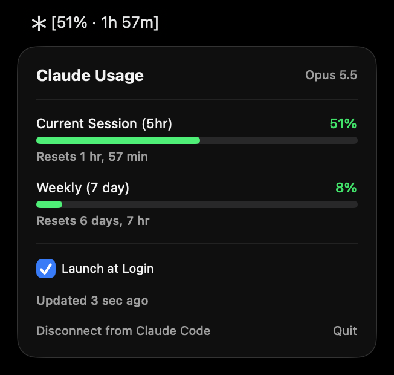

# Tokenz

Usage limits for Claude Code in your menu bar. A native macOS app that shows where you stand at a glance.


<p align="center">
  
</p>

The menu bar shows how much of Claude Code's 5-hour session window you have
used and how long until it resets: `[51% · 1h 57m]`. The asterisk next to it
is green under 60%, orange from 60%, and red from 85%. Click for the weekly
window, exact reset times, and a Launch at Login toggle. You get a
notification at 70%, 85%, and 95%, so you know before you hit the wall.

No daemons. No network. No account sign-in. Tokenz reads the rate-limit
data Claude Code already hands to its status line command, writes it to a
small local file, and watches that file for changes. That's it.

## Why this exists

If you've used Claude Code on Pro or Max, you know how this goes. You're deep in a coding session, the responses slow down or stop, and you discover you've burned the 5-hour window or your week. At that point the only options are wait it out or switch to API billing. Neither is what you want mid-task.

Anthropic shows usage in the web console, but you have to go look. There's no signal on your machine while you work. Tokenz is that signal.

## Highlights

- **Glanceable** — percentage and reset countdown in the menu bar, color-coded by how close you are.
- **Always visible** — when Claude Code goes quiet, the last-known number stays up with a tilde (`~51%`) until the window resets, then reads `~0%`.
- **Threshold notifications** — one alert per threshold per window. A first launch at 95% gets one notification, not three.
- **One-click setup** — a **Connect to Claude Code** button does the wiring. No Terminal, no Homebrew. If you already have a custom status line, it keeps showing.
- **Where your usage went** — the popover estimates how your Claude Code usage on this Mac splits across models (Fable, Opus, Sonnet).
- **Right with many sessions open** — an idle Claude Code session can't overwrite the current number with an old one.
- **Launch at Login** — one-click toggle, backed by `SMAppService`.
- **Small** — about 1,700 lines of Swift, unit tests for the logic that edits your settings, zero third-party dependencies.
- **Private** — everything stays on your machine; the app makes zero network calls.

## Requirements

- A Mac with Apple Silicon (M1 or later)
- macOS 14.0 (Sonoma) or later
- [Claude Code](https://claude.com/claude-code) installed
- Claude.ai Pro or Max subscription (rate limit data only appears on these tiers)

## Install

1. Download the `.dmg` from the [latest release](https://github.com/creativepulsenow/tokenz/releases/latest).
2. Open it and drag `Tokenz.app` onto the Applications shortcut.
   *(Connecting to Claude Code, Launch at Login and notifications all need the app to live in `/Applications`.)*
3. Launch `Tokenz.app` from `/Applications`. **First time only:** macOS will refuse to open it because the app is ad-hoc signed and not yet notarized. Open **System Settings → Privacy & Security**, scroll down to the message about Tokenz, and click **Open Anyway**. (On macOS 14 you can instead right-click the app → **Open**.) Every later launch is normal.
4. Click the menu bar item, then **Connect to Claude Code**.
   This adds a `statusLine` entry to `~/.claude/settings.json`. The app keeps a backup of the file, changes nothing else in it, and refuses if the file isn't valid JSON.
5. Send any message in Claude Code so it reports the first batch of usage data. (If nothing shows up, quit and relaunch Claude Code once.)

You should see an asterisk and a percentage in your menu bar.

**Already have a status line?** Connect keeps it. Tokenz runs first, then hands the same input to your command and shows its output, so your status line looks the same as before. The popover shows the command it runs for you, with a button to stop.

**Upgrading from ClaudeMonitor?** Tokenz is the same app under a new name (1.3 and earlier shipped as ClaudeMonitor). Install Tokenz, open it, and click **Update Connection**. Then delete `ClaudeMonitor.app`, and optionally `~/Library/Application Support/ClaudeMonitor` and `~/.claude/claude-monitor-statusline.sh`. Launch at Login and notifications need to be turned on again.

**Prefer to edit the file yourself?** Add this to `~/.claude/settings.json`:

```json
"statusLine": {
  "type": "command",
  "command": "'/Applications/Tokenz.app/Contents/MacOS/Tokenz' --statusline"
}
```

## Build from source

The Xcode project is committed, so Xcode is all you need:

```bash
open Tokenz.xcodeproj
```

To build the same DMG that ships in releases (it also runs the release checks):

```bash
./Scripts/make-dmg.sh
# -> build/Tokenz-<version>.dmg, app in build/xcode-derived/Build/Products/Release/
```

To run the unit tests:

```bash
xcodebuild -project Tokenz.xcodeproj -scheme Tokenz test
```

The project file is generated from `project.yml` with [XcodeGen](https://github.com/yonaskolb/XcodeGen). After changing `project.yml` or adding files, run `brew install xcodegen && xcodegen generate`.

## How it works

```
Claude Code ──(stdin JSON)──▶ Tokenz --statusline ──▶ ~/Library/Application Support/Tokenz/usage.json
                                                                     │
                                                          (file-system dispatch source)
                                                                     │
                                                                     ▼
                                                                Tokenz.app
                                                         (menu bar + notifications)
```

- Claude Code runs the app's binary in `--statusline` mode after each assistant message and pipes session JSON to it on stdin. In that mode the binary does its job in a few milliseconds and exits; it never opens a window.
- It stores the two rate-limit windows and the model name in a small owner-only JSON file, replacing the file in one step so the app never reads half of it.
- With several Claude Code sessions open, each one re-runs the status line now and then with the numbers from its own last reply. Tokenz notes each session's accumulated API time and only accepts a reading from a session that has had a new reply since its last run, so an idle session can't overwrite the current number with an old one.
- The app watches the file with a file-system dispatch source and re-renders on every change. As a safety net it also checks the file's modification time every 10 seconds.
- Alerts fire once per threshold per window; state persists in `UserDefaults` so restarts don't re-fire.

**No network calls. No daemons. No polling of Anthropic.** The app makes zero API requests: it only reads what Claude Code has already fetched. Tokenz consumes **zero quota**.

### Update cadence

Tokenz is a passive observer. The cadence comes entirely from Claude Code running the status line:

- **Active session:** updates every assistant turn, typically every 5–30 seconds during back-and-forth, less often during long tool-heavy responses. File-write to menu bar latency is sub-second.
- **Claude Code open but idle, or not running:** no updates. After 90 seconds the menu bar adds a tilde (`~51%`) and the popover shows a banner. The last-known number stays until the 5-hour window rolls over, then reads `~0%`: usage only moves when you use Claude, so the last reading stays right while you're idle.

The one thing a tilde number can miss is usage from claude.ai web, mobile or another machine; send any message in Claude Code to pick that up.

#### Why the menu bar can show 1% less than the Anthropic web console

If you compare the menu bar to claude.ai's usage page mid-conversation, the web will sometimes read 1% (occasionally 2%) higher. Two reasons, neither a bug:

- **Timing.** The status line runs after an assistant message completes. The web console reads live account state, which already includes the message in flight. When the response finishes, the menu bar catches up within a second.
- **Rounding.** Tokenz rounds down, so 99.6% reads as 99%, never as 100% while there is still room.

Closing the one-turn gap would mean polling Anthropic directly, with credentials and network calls. Not worth it for the gap it closes.

### What Tokenz sees

Rate limits live on your Anthropic account, but Tokenz only learns about them when Claude Code runs the status line:

| Where you use Claude | Updates the menu bar? |
|---|---|
| Claude Code (terminal or IDE) | ✅ every assistant turn |
| Claude.ai web chat | ❌ nothing local runs |
| Claude mobile app | ❌ nothing local runs |

Limits are account-wide, so whatever you use on the web or mobile shows up in Tokenz with the next Claude Code turn. If you never use Claude Code, Tokenz has nothing to show.

## Reliability and limits

Tokenz is best-effort. A few caveats before you rely on it:

- **It only sees what Claude Code on this Mac sees.** See the table above.
- **It's at least one assistant turn behind live account state.** See [Update cadence](#update-cadence).
- **Notifications can be missed.** Thresholds only fire while the app is running and an update arrives that crosses them. Cross 85% on the web while Tokenz is closed and that alert is skipped.
- **The 95% alert is late by design.** By the time it fires you're nearly out for the window. If you want earlier warning, watch for the 70% one.
- **A number with a tilde is a last-known value.** It doesn't include anything used on the web, mobile or another machine since the last update.
- **Per-model limits aren't shown yet.** Some models (Fable, for one) have their own weekly limit. Claude Code only passes the 5-hour and the general weekly window to the status line today, so check `/usage` in Claude Code for the others. If Claude Code starts passing them, Tokenz shows them as extra rows automatically.
- **"Where your usage went" is a split, not a limit.** It is the share of your Claude Code usage on this Mac that went to each model since the app started counting this week (the popover says when), worked out from each session's own cost figures (or API time when there is no cost). It doesn't include the web, mobile or other machines, and it is not how close you are to a model's own limit.

Use it as background information. If hitting a window mid-task would cost you real money or break a deadline, keep your own habit running too.

## Security notes

- **Inputs are checked at the boundary.** Percentages are clamped to 0–100, timestamps outside a plausible range are rejected, and control and bidi-override characters are stripped from the model name. A buggy process that writes junk to `usage.json` can't crash the app. (Any process running as you can make the app show a wrong number, the same way it could edit the file.)
- **`usage.json` is read defensively.** The app opens it without following symlinks, checks the open file is a small regular file, then reads. The file and its directory are owner-only.
- **Connect changes one entry in `~/.claude/settings.json` and nothing else.** It re-parses its own edit and refuses to write if anything other than `statusLine` would differ. It refuses a file that isn't valid JSON, lists `statusLine` twice, is read-only, or changed while it was working (checked right before the write). It writes through symlinks so dotfile managers (stow, chezmoi, yadm) keep working.
- **Backups stay private.** Before each change the app saves a full copy of `settings.json` in `~/Library/Application Support/Tokenz/settings-backups`, owner-only, and keeps the newest five. They contain whatever you keep in that file.
- **What it keeps.** Claude Code passes session details to every status line command. Tokenz stores the usage percentages, their reset times, the model name, one small record per session (the session id with its accumulated API time and cost), and this week's totals per model. It never asks for your Claude login and does not read or store tokens, the Keychain, or your conversations.
- **What it runs.** The only program the app ever starts is the status line command saved in `~/Library/Application Support/Tokenz/chained-statusline-command`: your previous status line, if you had one when you connected. It receives the same session details Claude Code would have given it. The popover shows that command and lets you stop it.
- **Release builds** use the hardened runtime, carry no entitlements, are stripped, and contain no build-machine paths. `Scripts/make-dmg.sh` fails if any of that stops being true.
- **No sandbox.** The app has to edit `~/.claude/settings.json` and share an Application Support path with the `--statusline` process that Claude Code launches.
- **Not notarized yet.** The app is ad-hoc signed, so macOS can't verify who built it. Check the SHA-256 on the release page, or build from source.

- **Releases are built in the open.** From 1.4.4 on, each DMG is built by GitHub Actions from the tagged commit and published with a signed provenance record. To check a download: `gh attestation verify Tokenz-<version>.dmg -R creativepulsenow/tokenz`.

To report a vulnerability, see [SECURITY.md](SECURITY.md).

## Uninstall

1. Click the menu bar item, then **Disconnect from Claude Code**. This removes the `statusLine` entry from `~/.claude/settings.json`, or puts your previous status line back if you had one. Do this before deleting the app: otherwise Claude Code keeps trying to run a program that is no longer there.
2. Quit Tokenz.
3. Move `Tokenz.app` to the Trash.
4. Optional: `rm -rf ~/Library/Application\ Support/Tokenz` and `defaults delete com.creativepulsenow.tokenz`.

## Privacy

All data stays on your machine. The status line command reads what Claude Code already pipes to it, writes a small local file, and the menu bar app reads that file. Nothing is sent anywhere.

## Disclaimer

This is an independent, community project. It is **not affiliated with,
endorsed by, or sponsored by Anthropic**. "Claude" and "Claude Code" are
trademarks of Anthropic, used here only to describe what the app works
with (nominative fair use).

The app reads only the rate-limit data that Claude Code already pipes to its
status line command. If Anthropic changes that data shape, the app will
show no data until updated.

**No warranty. Use at your own risk.** Provided "as is" — see [LICENSE](LICENSE) for the full text. It will miss limit crossings sometimes, and it can't stop you from being charged or rate-limited. If overage matters for your work, don't rely on this app alone to catch it.

## Background

The original design notes are kept for the reasoning behind the approach
(why a status line bridge instead of scraping the web console or calling
Anthropic's API directly). They describe version 1.0 and are out of date on
setup details:

- [docs/technical-plan-v3.md](docs/technical-plan-v3.md)
- [docs/technical-plan-v3.1.md](docs/technical-plan-v3.1.md)

## License

MIT — see [LICENSE](LICENSE).
